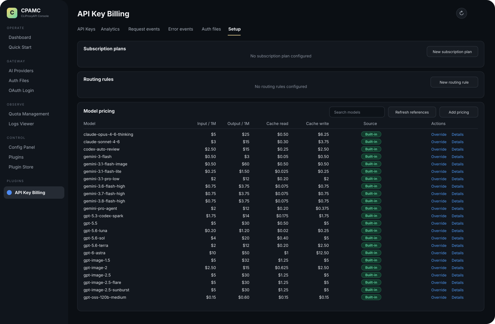
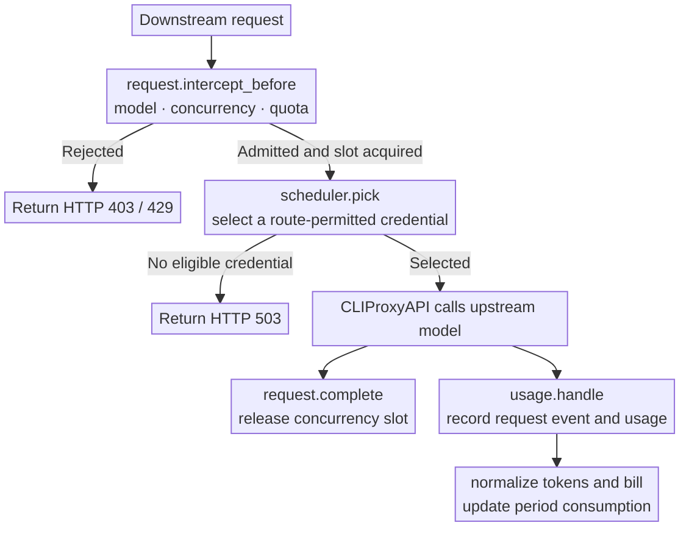
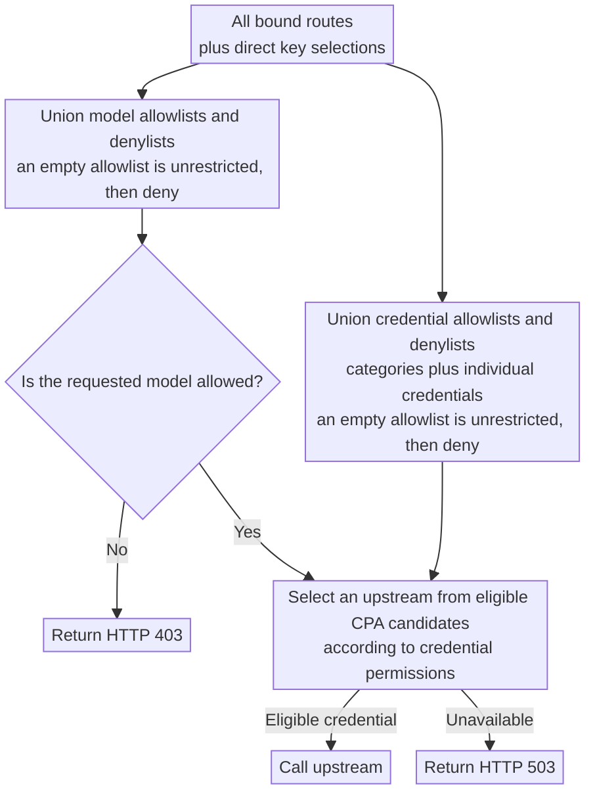

<div align="center">
  <h1>CPA Key Billing</h1>
  <p><strong>API-key billing and subscription quota plugin for <a href="https://github.com/router-for-me/CLIProxyAPI">CLIProxyAPI</a>.</strong></p>
  <p>
    <a href="https://github.com/4pii4/cpa-plugin-key-billing/releases/latest"></a>
    <a href="https://github.com/4pii4/cpa-plugin-key-billing/actions/workflows/check.yml"></a>
    
    <a href="./LICENSE"></a>
  </p>
</div>


## Features

- Enforces spend, token, and request quotas with either per-key periods or synchronized subscription-plan resets
- Supports long-context **tiered pricing** based on an input-token threshold
- Sets a **maximum concurrent request count** for each API key
- Binds **routing rules** to each API key to restrict model access and upstream credentials
- Retrieves reference model prices from [models.dev](https://models.dev/)
- Ships fallback prices for common CPA model aliases so fresh installations can bill them immediately

## How it works

Before a request reaches an upstream provider, the plugin checks its subscription quota, concurrency limit, and routing policy. After the upstream call finishes, CLIProxyAPI supplies usage through `usage.handle`. The plugin records the request event, calculates its cost, and updates consumption for the active quota period.



The plugin integrates with CLIProxyAPI's request path through synchronous RPC methods. Admission and credential scheduling perform only local state lookups and rule evaluation: they do no network I/O and never copy or parse upstream responses. Usage recording and billing happen through `usage.handle` after the upstream call. The plugin creates no background goroutines, timers, or asynchronous refresh jobs, so its resource footprint is small and its request-path overhead is limited to lightweight local checks.

## Requirements

- CLIProxyAPI `7.2.143` or newer; the latest release is recommended
- A plugin-enabled CLIProxyAPI build, not a `no-plugin` build

## Installation

Run the installer from the CLIProxyAPI root directory. On macOS and Linux:

```sh
curl -LsSf https://raw.githubusercontent.com/4pii4/cpa-plugin-key-billing/main/install.sh | sh
```

On Windows, stop CLIProxyAPI first, then run this command in PowerShell:

```powershell
irm https://raw.githubusercontent.com/4pii4/cpa-plugin-key-billing/main/install.ps1 | iex
```

The installer places the plugin in the current directory's `plugins/` folder. Restart CLIProxyAPI after installing or upgrading.

Alternatively, download the package for your platform from [Releases](../../releases/latest), extract it, and place the dynamic library in CLIProxyAPI's `plugins/` directory:

```text
plugins/cpa-key-billing.so       # Linux
plugins/cpa-key-billing.dylib    # macOS
plugins/cpa-key-billing.dll      # Windows
```

## Configuration

Add the following to the CLIProxyAPI configuration file:

```yaml
plugins:
  enabled: true
  dir: "plugins"
  configs:
    cpa-key-billing:
      enabled: true
      debug: false # Log debug details such as routing and reference-price matches
      codex_fast_mode_billing: false # Bill Codex priority requests at 2.5x when enabled
      state_file: "plugins/cpa-key-billing-state-v1.db"
```

When `codex_fast_mode_billing` is enabled, Codex upstream requests containing `service_tier=priority` are billed at **2.5 times** the standard cost.

> [!WARNING]
> Back up the data file before upgrading.
>
> - Database files from v1.0.0 through the latest version are migrated automatically.
> - JSON or SQLite data files from v0.8.4 and earlier cannot be migrated. Point `state_file` to a new file instead.

After restarting CLIProxyAPI, open **API Key Billing** in the management center. Review the model prices, create a subscription plan, and bind the API keys that should be limited.

## Accessing the UI

Administrators can open **API Key Billing** from the CLIProxyAPI management center or use this URL directly:

```text
http(s)://<CLIProxyAPI-address>/v0/resource/plugins/cpa-key-billing/ui
```

Users can view their own subscription quota and usage with their API key at:

```text
http(s)://<CLIProxyAPI-address>/v0/resource/plugins/cpa-key-billing/ui#account
```

## Billing and subscription rules

- An API key without a subscription plan is metered but has no quota limit.
- A subscription plan can contain multiple custom quota windows. Each window can limit spend, tokens, requests, or any combination of the three.
- Each API key is billed independently. An independent period starts on the key's first admitted request. A synchronized period gives each window a fixed next-start time and resets all bound keys on that schedule.
- A manual reset keeps synchronized reset times unchanged. An independent period starts again on its next admitted request.
- Price precedence is custom, built-in, then models.dev reference. A request is rejected if no price is available.
- Request events are retained for 365 days.

### Built-in model prices

The plugin includes fallback prices for the CPA identifiers shown below. Rates are USD per million tokens and were verified on September 14, 2026. Custom prices override these defaults. Google advertises the `gemini-3.6-flash-high`, `gemini-3.7-flash-high`, and `gemini-3.8-flash-high` rates through December 31, 2026; recheck them before 2027.

| Model | Input | Output | Cache read | Cache write | Long context |
| --- | ---: | ---: | ---: | ---: | --- |
| `claude-opus-4-6-thinking` | $5 | $25 | $0.50 | $6.25 | — |
| `claude-sonnet-4-6` | $3 | $15 | $0.30 | $3.75 | — |
| `codex-auto-review` | $2.50 | $15 | $0.25 | input rate | >272K: $5 / $22.50 / $0.50 |
| `gemini-3-flash` | $0.50 | $3 | $0.05 | input rate | — |
| `gemini-3.1-flash-image` | $0.50 | $60 | input rate | input rate | — |
| `gemini-3.1-flash-lite` | $0.25 | $1.50 | $0.025 | input rate | — |
| `gemini-3.1-pro-low` | $2 | $12 | $0.20 | input rate | >200K: $4 / $18 / $0.40 |
| `gemini-3.6-flash-high` | $0.75 | $3.75 | $0.075 | input rate | — |
| `gemini-3.7-flash-high` | $0.75 | $3.75 | $0.075 | input rate | — |
| `gemini-3.8-flash-high` | $0.75 | $3.75 | $0.075 | input rate | — |
| `gemini-pro-agent` | $2 | $12 | $0.20 | $0.375 | — |
| `gpt-5.3-codex-spark` | $1.75 | $14 | $0.175 | input rate | — |
| `gpt-5.5` | $5 | $30 | $0.50 | input rate | >272K: $10 / $45 / $1 |
| `gpt-5.6-luna` | $0.20 | $1.20 | $0.02 | $0.25 | >272K: 2x input/cache, 1.5x output |
| `gpt-5.6-sol` | $4 | $20 | $0.40 | $5 | >272K: 2x input/cache, 1.5x output |
| `gpt-5.6-terra` | $2 | $12 | $0.20 | $2.50 | >272K: 2x input/cache, 1.5x output |
| `gpt-6-astra` | $10 | $50 | $1 | $12.50 | >272K: 2x input/cache, 1.5x output |
| `gpt-image-1.5` | $5 | $32 | $1.25 | input rate | — |
| `gpt-image-2` | $2.50 | $15 | $0.625 | input rate | — |
| `gpt-image-2.5` | $5 | $30 | $1.25 | input rate | — |
| `gpt-image-2.5-flare` | $5 | $30 | $1.25 | input rate | — |
| `gpt-image-2.5-sunburst` | $5 | $30 | $1.25 | input rate | — |
| `gpt-oss-120b-medium` | $0.15 | $0.60 | input rate | input rate | — |

Sources: [Anthropic pricing](https://platform.claude.com/docs/en/about-claude/pricing), [Gemini API pricing](https://ai.google.dev/gemini-api/docs/pricing), and [OpenAI API pricing](https://developers.openai.com/api/docs/pricing). For image models, the generic input and cache fields use text-token rates while output uses the image-token rate. `gemini-pro-agent` and `gpt-oss-120b-medium` are CPA route aliases rather than vendor API model IDs; their supplied route rates are documented in code.

## Routing rules

Bind routing rules on the API Key page, or select models, entire credential categories, and individual credentials directly. Click a model or credential checkbox to cycle between unselected, allowlisted (check mark), and denylisted (cross). A credential category also covers credentials added to that category later; individual credentials can still be excluded by the denylist. Model and credential permissions independently merge every bound rule with direct selections: allowlists are unioned, denylists are unioned, and deny always wins. An empty allowlist permits everything except denylisted entries.



## Intercepted-request responses

| Scenario | Status | `type` | `code` |
| --- | --- | --- | --- |
| API key concurrency limit reached | `429` | `rate_limit_error` | `rate_limit_exceeded` |
| Subscription quota exhausted | `429` | `rate_limit_error` | `rate_limit_exceeded` |
| Model access denied | `403` | `permission_error` | `insufficient_quota` |
| No eligible, available credential | `503` | `server_error` | `internal_server_error` |
| A bound routing rule is missing or corrupt | `503` | `server_error` | `routing_configuration_error` |
| Model has no price | `503` | `cpa_key_billing_error` | `model_price_error` |

## Acknowledgements

- [LINUX DO](https://linux.do/) — a community for developers and technology enthusiasts
