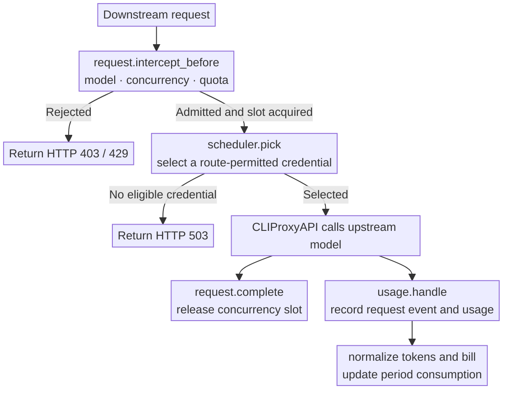
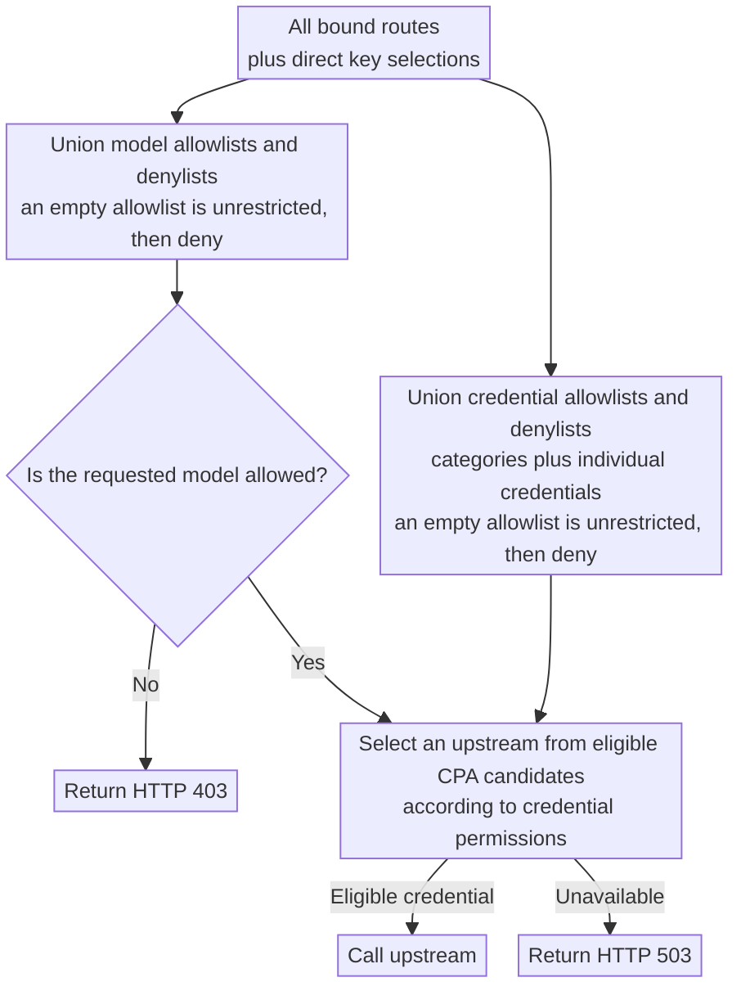

<div align="center">
  <h1>CPA Key Billing</h1>
  <p><strong>API-key billing and subscription quota plugin for <a href="https://github.com/router-for-me/CLIProxyAPI">CLIProxyAPI</a>.</strong></p>
  <p>
    <a href="https://github.com/4pii4/cpa-plugin-key-billing/releases/latest"></a>
    <a href="https://github.com/4pii4/cpa-plugin-key-billing/actions/workflows/check.yml"></a>
    
    <a href="./LICENSE"></a>
  </p>
</div>


CPA Key Billing adds per-key billing, quotas, routing, and account-level usage views to CLIProxyAPI. It runs as an in-process CPA plugin and stores its state in SQLite.

## What it does

- Enforces spend, token, and request quotas using independent or synchronized billing periods.
- Limits concurrent requests per downstream API key.
- Restricts models and upstream credentials with allowlists and denylists.
- Routes Codex traffic through Plus accounts before spending a Pro/Pro 20x reserve.
- Supports long-context pricing tiers.
- Records request cost, latency, TTFT, token usage, and upstream failures from `usage.handle`.
- Watches opted-in Codex 5-hour and weekly windows and can start a fresh window with one small request.
- Can pause the exact downstream key that receives a `cyber_policy` refusal.
- Masks account emails across administrator and account views when requested.
- Includes built-in prices for common CPA aliases and can refresh reference prices from [models.dev](https://models.dev/).

## Requirements

- CLIProxyAPI `7.2.143` or newer. Use the latest plugin-enabled build when possible; `no-plugin` builds cannot load this project.
- A writable plugin directory and SQLite state-file location.
- At least one downstream API key. Configure a CLIProxyAPI management secret to use the administrator UI and management API.
- For source builds: Go 1.24 or newer, CGO, and a C compiler for the target platform.

## Install and set up

The examples below use `/opt/cliproxyapi` as the CPA directory and port `8317`. Replace those values with your installation paths. Stop CPA before replacing the plugin or copying its SQLite database.

### 1. Back up an existing installation

Skip this step on a first install. Otherwise, stop CPA and copy the state database while it is closed so the SQLite WAL is included cleanly.

```sh
systemctl --user stop cliproxyapi.service
mkdir -p /opt/cliproxyapi/backups
cp -p /opt/cliproxyapi/plugins/cpa-key-billing-state-v1.db \
  "/opt/cliproxyapi/backups/cpa-key-billing-$(date +%Y%m%dT%H%M%S).db"
```

Keep the backup when upgrading across a schema change. Older plugin versions may not understand a newer database.

### 2. Install a release

Run the installer from the CLIProxyAPI directory. It downloads the latest release, verifies its checksum, and writes the platform library under `plugins/`.

Linux or macOS:

```sh
cd /opt/cliproxyapi
curl -LsSf https://raw.githubusercontent.com/4pii4/cpa-plugin-key-billing/main/install.sh | sh
```

Windows PowerShell:

```powershell
Set-Location C:\path\to\cliproxyapi
irm https://raw.githubusercontent.com/4pii4/cpa-plugin-key-billing/main/install.ps1 | iex
```

You can also download an archive from [Releases](../../releases/latest) and place the extracted library at the matching path:

```text
plugins/cpa-key-billing.so       # Linux
plugins/cpa-key-billing.dylib    # macOS
plugins/cpa-key-billing.dll      # Windows
```

### 3. Configure CLIProxyAPI

Add a `cpa-key-billing` entry under the `plugins.configs` section of CPA's `config.yaml`. Use absolute paths when CPA runs under a service manager.

```yaml
plugins:
  configs:
    cpa-key-billing:
      enabled: true
      priority: 10
      debug: false
      state_file: "/opt/cliproxyapi/plugins/cpa-key-billing-state-v1.db"
```

This plugin must have the highest plugin priority.

The remaining fields belong to CPA Key Billing:

| Field | Default | Purpose |
| --- | --- | --- |
| `enabled` | `false` | Enables billing and policy enforcement. |
| `debug` | `false` | Records detailed routing and reference-price decisions in plugin logs. |
| `state_file` | `plugins/cpa-key-billing-state-v1.db` | SQLite state path, relative to CPA's working directory unless absolute. |

### 4. Run CPA with systemd user services

If CPA already has a working service, keep it and restart after changing the plugin or configuration. For a new user service, create `~/.config/systemd/user/cliproxyapi.service`:

```ini
[Unit]
Description=CLIProxyAPI Service
Wants=network-online.target
After=network-online.target

[Service]
Type=simple
WorkingDirectory=/opt/cliproxyapi
ExecStart=/opt/cliproxyapi/cli-proxy-api -config /opt/cliproxyapi/config.yaml
Restart=always
RestartSec=10

[Install]
WantedBy=default.target
```

Then reload and start it:

```sh
systemctl --user daemon-reload
systemctl --user enable --now cliproxyapi.service
systemctl --user status cliproxyapi.service --no-pager
journalctl --user -u cliproxyapi.service -n 80 --no-pager
```

The startup log should show `plugin_id=cpa-key-billing` as both loaded and registered.

### 5. Complete first-time setup in the UI

Open the administrator interface at:

```text
http://127.0.0.1:8317/v0/resource/plugins/cpa-key-billing/ui
```

Then:

1. Review model prices. Add custom prices for any model that has neither a built-in nor a models.dev reference price.
2. Create subscription plans and bind them to downstream API keys. Unbound keys are metered but are not quota-limited.
3. Add routing rules if a key should be limited to specific models or upstream credentials.
4. Configure concurrency and cyber-policy protection if needed.
5. On **Auth file**, refresh Codex quotas before enabling tiered routing.

API-key users can open the same page at `#account` to see only their own plan, routing permissions, usage, and request history.

### 6. Configure Plus-first / Pro-reserve routing

This plugin must have the highest plugin priority so that its scheduler hook runs before any other plugin.

For file-based Codex credentials, each auth JSON file has a `priority` field. CPA keeps only the highest eligible credential-priority tier before calling plugins. Every Plus and Pro account participating in the same primary/reserve pool must use the same `priority` value so that CPA offers them all to the plugin. Positive `weight` values control distribution within the pool selected by this plugin.

```json
{
  "type": "codex",
  "priority": 0,
  "weight": 1
}
```

| Field | Purpose |
| --- | --- |
| `priority` | Credential priority used by CPA to select the eligible tier. All accounts in the same routing pool must share this value. |
| `weight` | Traffic distribution weight within the pool selected by this plugin. Must be positive. |

Do not give the Pro reserve a higher credential priority. CPA would filter out the Plus accounts before calling the plugin, which defeats tiered routing.

Restart CPA after editing auth files. On **Auth file**:

1. Confirm every participating account is enabled and supports the same requested models.
2. Leave **Routing pool** at **Auto by plan**, or set explicit primary/reserve overrides where plan metadata is missing.
3. Enable **Plus first, Pro reserve**.
4. Send one Codex request, refresh the page, and confirm the status no longer says that the scheduler hook is unconfirmed.

### 7. Verify the live hook

Read secrets without putting them directly in shell history:

```sh
read -rsp "CPA management key: " CPA_MANAGEMENT_KEY; printf '\n'
read -rsp "CPA downstream key: " CPA_DOWNSTREAM_KEY; printf '\n'
```

Use the original plaintext management secret. If CPA has replaced the value in `config.yaml` with a password hash, that hash is not a valid bearer credential.

Confirm the plugin is registered:

```sh
curl -fsS \
  -H "Authorization: Bearer ${CPA_MANAGEMENT_KEY}" \
  http://127.0.0.1:8317/v0/management/plugins \
  | jq '.plugins[] | select(.id == "cpa-key-billing") | {id, registered, effective_enabled}'
```

Send a real request:

```sh
curl -fsS http://127.0.0.1:8317/v1/responses \
  -H "Authorization: Bearer ${CPA_DOWNSTREAM_KEY}" \
  -H "Content-Type: application/json" \
  --data '{
    "model": "gpt-5.6-luna",
    "input": [{
      "role": "user",
      "content": [{"type": "input_text", "text": "Reply with exactly OK."}]
    }],
    "stream": false,
    "store": false
  }' \
  | jq '{status, model}'
```

Now inspect routing status:

```sh
curl -fsS \
  -H "Authorization: Bearer ${CPA_MANAGEMENT_KEY}" \
  http://127.0.0.1:8317/v0/management/plugins/cpa-key-billing/codex-routing \
  | jq '{enabled: .settings.enabled, last_hook_at, last_pool}'
```

`last_hook_at` must be non-zero after traffic. `last_pool` is `primary`, `other`, `reserve`, or `waiting`. An enabled toggle by itself does not prove that CPA called this plugin's scheduler.

Clear the temporary shell variables when finished:

```sh
unset CPA_MANAGEMENT_KEY CPA_DOWNSTREAM_KEY
```

## How it works

Before a request reaches an upstream provider, the plugin checks its cyber-policy cooldown, subscription quota, concurrency limit, and routing policy. After the upstream call finishes, CLIProxyAPI supplies usage and upstream failures through `usage.handle`. The plugin records the request event, calculates its cost, updates consumption for the active quota period, and applies any enabled cooldown.



The plugin integrates with CLIProxyAPI's request path through synchronous RPC methods. Admission and credential scheduling perform local state lookups and rule evaluation; the optional Codex router also reads the local host credential inventory at most once every 30 seconds. Neither performs provider HTTP requests or parses model responses. Usage recording and billing happen through `usage.handle` after the upstream call. The plugin creates no background goroutines, timers, or asynchronous refresh jobs.

### Codex Plus-first / reserve routing

On the administrator **Auth file** page, enable **Plus first, Pro reserve**. The setting is off by default and lives in this plugin's database, not CPA's configuration. Automatic classification uses CPA's `plan_type` attribute and fresh quota-query plan information: Plus is primary, Pro/Pro 20x is reserve, and unknown/other plans sit between them. Use the per-account **Routing pool** selector to explicitly protect your reserve or assign a primary account. The plugin returns a concrete account selection even when API-key routing rules are unrestricted, overriding CPA's normal selector for eligible Codex-account-only pools. Accounts within a pool share traffic using their positive CPA weights; all usable primary quota is preferred over reserve quota.

- Only Codex authentication-file accounts participate. Other providers, configured API keys, mixed-provider pools, and nested plugin model calls retain their existing behavior. Existing credential access rules always apply.
- The policy works without an open browser. `usage.handle` supplies actual failures/successes, while **Refresh quotas** enriches the server's process-local evidence with 5-hour, weekly, and model-specific windows. Browser/session-storage values are never trusted for routing. Spark and code-review limits are kept separate. Reported limits apply to reserve accounts too; a missing weekly window is not invented.
- Exhausted quota evidence is rechecked by an actual model request after its reported reset or after two minutes, whichever comes first. A generic 429 uses a 30-second cooldown. Recovery probes are limited to one per account/window every 30 seconds and expire even if completion feedback is lost. Healthy Plus accounts take precedence again after fresh successful evidence. Failed quota refreshes do not erase evidence; overlapping responses, old request reports, and changed credential revisions cannot overwrite newer state. No background polling or automatic reset-credit spending occurs.
- **Host boundary:** CPA supplies only its eligible, highest-priority candidate tier. Keep participating accounts at the same CPA priority. The plugin cannot override disabled accounts, zero weights, model incompatibility, hard cooldowns, pinned credentials, or a host execution path that does not invoke `scheduler.pick` (including Home mode on CPA 7.2.143). The page reports whether a Codex scheduler call has actually been observed; refresh the page status after traffic. Stale plugin evidence cannot hold an account indefinitely, but a CPA cooldown still can prevent its recovery probe.
- Settings and fingerprint-based role overrides survive restarts. Quota snapshots and probe leases deliberately do not. Schema 15 adds the settings table; back up the database before upgrading, and restore that backup before downgrading.

### Codex window auto-start

Each Codex authentication-file card has an **Auto-start 5h / weekly windows** switch. It is off by default and independent of Plus-first routing. For an opted-in account, the plugin reads the ordinary Codex quota windows during host activity. Inactive windows report a reset timestamp that slides forward; active windows keep a fixed timestamp. A slide of at least 30 seconds, an exhausted window becoming available, or usage unexpectedly dropping to the beginning identifies a fresh regular or globally gifted reset.

Once the fresh state is confirmed and neither ordinary window is exhausted, the plugin sends `gpt-5.6-luna` the text `hi`, asks it to reply with `OK`, selects no reasoning, and drains the complete stream. Codex starts the window only after that stream finishes. The packet consumes a small amount of upstream quota, so the switch is per account. One account cannot receive another packet for 10 minutes, and a failed check or packet waits 15 minutes before retrying. Spark and code-review windows neither trigger nor block the ordinary-window packet.

The plugin creates no timer or background goroutine. Completed client requests and Codex-routing settings updates synchronously advance one due account, so the feature works without an open browser while CLIProxyAPI is active. A completely idle proxy performs no network work; the next completed request resumes the checks. Runtime observations are discarded on restart, requiring a new baseline before a packet can be sent. The plugin keeps polling accounts whose weekly window is exhausted, which lets an unannounced global reset override the previously advertised reset date immediately on the next observation.

Quota checks and packets use CLIProxyAPI's host HTTP transport and therefore honor its global proxy. CLIProxyAPI 7.2.143 does not expose a credential-bound HTTP client to RPC plugins, so authentication files with their own `proxy_url` are reported as unsupported and are not auto-started.

Administrator API: `GET /v0/management/plugins/cpa-key-billing/codex-routing` returns `settings`, `last_hook_at`, `last_pool`, and `auto_start_accounts`. `PUT` the settings object `{ "enabled": true, "roles": { "sha256:…": "reserve" }, "auto_start": { "sha256:…": true } }` to save. Roles may be `primary` or `reserve`; omitting a role restores automatic classification, while omitting an auto-start fingerprint disables packets for that account. Codex entries in the administrator `/auth-files` response expose their `routing_ref`. API-key self-service users cannot edit this policy.

### Cyber-policy cooldown

Settings includes an optional downstream-key cooldown for the provider response code `cyber_policy` with HTTP status 400. It is disabled by default and uses a 15-minute base delay until changed. When enabled, the plugin uses the API key on the exact `usage.handle` failure record, derives the same hashed caller scope used during request admission, and pauses only that CPA billing API key. Plaintext API keys are never added to cooldown state or logs.

Each consecutive detection doubles the delay, up to 30 days, including a new refusal after the previous cooldown expires. A different observed outcome breaks the streak without shortening a cooldown already protecting the key. State is written synchronously and survives restarts, so stale browser data or a restart cannot silently bypass an active pause. Requests rejected by the cooldown receive HTTP 429, `Retry-After`, and the `cyber_policy_cooldown` code before pricing, concurrency, quota, or upstream credential selection. In-flight requests can still report their final outcomes.

Administrators can view each active key and clear its cooldown immediately in Settings. Turning the feature off admits requests immediately and clears all active cooldown state. Schema 16 adds the persistent settings table; back up the database before upgrading, and restore that backup before downgrading.

Administrator API:

- `GET /v0/management/plugins/cpa-key-billing/cyber-policy` returns `settings` and active `bans`.
- `PUT /v0/management/plugins/cpa-key-billing/cyber-policy` saves `{ "enabled": true, "base_delay_seconds": 900 }`.
- `DELETE /v0/management/plugins/cpa-key-billing/cyber-policy?scope=<hashed-scope>` clears one key.

## Build from source

Native builds require Go 1.24+, CGO, and a working C compiler. Build from the repository root.

Linux:

```sh
mkdir -p dist
CGO_ENABLED=1 go build \
  -buildvcs=false \
  -trimpath \
  -ldflags="-s -w -buildid=" \
  -tags cshared \
  -buildmode=c-shared \
  -o dist/cpa-key-billing.so \
  ./cmd/cpa-key-billing
```

macOS:

```sh
mkdir -p dist
CGO_ENABLED=1 go build \
  -buildvcs=false \
  -tags cshared \
  -buildmode=c-shared \
  -o dist/cpa-key-billing.dylib \
  ./cmd/cpa-key-billing
```

Windows PowerShell:

```powershell
New-Item -ItemType Directory -Path dist -Force | Out-Null
$env:CGO_ENABLED = "1"
go build -buildvcs=false -trimpath `
  -ldflags="-s -w -buildid=" `
  -tags cshared -buildmode=c-shared `
  -o dist/cpa-key-billing.dll `
  ./cmd/cpa-key-billing
```

Copy the resulting library into CPA's plugin directory while CPA is stopped, then restart the service. Cross-compiling a CGO shared library also requires a C compiler for the target operating system and architecture; release builds use dedicated cross-toolchains for that reason.

### Development checks

Format Go before committing:

```sh
gofmt -l .
```

The command must print nothing. Billing, pricing, quota, usage, routing, or failure-reporting changes must also pass the CPA integration harness:

```sh
scripts/e2e_cpa_billing.sh v7.2.143
```

For changes to `internal/plugin/ui.html`, install the pinned formatter dependencies and use the repository formatter:

```sh
npm ci --prefix scripts
node scripts/format_ui.mjs --check
```

Start the dummy backend on the test-only port, then check affected desktop and narrow layouts with Playwright:

```sh
python3 scripts/frontend_dummy_backend.py --port 18765
```

Keep temporary Playwright regression scripts outside `scripts/`.

## Upgrade and recovery

1. Stop CPA.
2. Back up the SQLite state file.
3. Replace the plugin library.
4. Start CPA and check that the plugin registered without a migration error.
5. Send a priced request and confirm it appears under **Requests**.

Database files from v1.0.0 through the current version migrate automatically. JSON or SQLite files from v0.8.4 and earlier cannot be migrated; configure a new `state_file` instead. Do not downgrade after a schema migration unless you also restore the matching pre-upgrade database backup.

## Billing and subscription rules

- An API key without a subscription plan is metered but has no quota limit.
- A subscription plan can contain multiple custom quota windows. Each window can limit spend, tokens, requests, or any combination of the three.
- Each API key is billed independently. An independent period starts on the key's first admitted request. A synchronized period gives each window a fixed next-start time and resets all bound keys on that schedule.
- A manual reset keeps synchronized reset times unchanged. An independent period starts again on its next admitted request.
- Price precedence is custom, built-in, then models.dev reference. A request is rejected if no price is available.
- Request events are retained for 365 days.

### Built-in model prices

The plugin includes fallback prices for the CPA identifiers shown below. Rates are USD per million tokens and were verified on September 25, 2026. Custom prices override these defaults. Google advertises the `gemini-3.6-flash-high`, `gemini-3.7-flash-high`, and `gemini-3.8-flash-high` rates through December 31, 2026; recheck them before 2027.

| Model | Input | Output | Cache read | Cache write | Long context |
| --- | ---: | ---: | ---: | ---: | --- |
| `claude-opus-4-6-thinking` | $5 | $25 | $0.50 | $6.25 | — |
| `claude-sonnet-4-6` | $3 | $15 | $0.30 | $3.75 | — |
| `codex-auto-review` | $2.50 | $15 | $0.25 | input rate | >272K: $5 / $22.50 / $0.50 |
| `gemini-3-flash` | $0.50 | $3 | $0.05 | input rate | — |
| `gemini-3.1-flash-image` | $0.50 | $60 | input rate | input rate | — |
| `gemini-3.1-flash-lite` | $0.25 | $1.50 | $0.025 | input rate | — |
| `gemini-3.1-pro-low` | $2 | $12 | $0.20 | input rate | >200K: $4 / $18 / $0.40 |
| `gemini-3.6-flash-high` | $0.75 | $3.75 | $0.075 | input rate | — |
| `gemini-3.7-flash-high` | $0.75 | $3.75 | $0.075 | input rate | — |
| `gemini-3.8-flash-high` | $0.75 | $3.75 | $0.075 | input rate | — |
| `gemini-pro-agent` | $2 | $12 | $0.20 | $0.375 | — |
| `gpt-5.3-codex-spark` | $1.75 | $14 | $0.175 | input rate | — |
| `gpt-5.5` | $5 | $30 | $0.50 | input rate | >272K: $10 / $45 / $1 |
| `gpt-5.6-luna` | $0.20 | $1.20 | $0.02 | $0.25 | >272K: 2x input/cache, 1.5x output |
| `gpt-5.6-sol` | $4 | $20 | $0.40 | $5 | >272K: 2x input/cache, 1.5x output |
| `gpt-5.6-terra` | $2 | $12 | $0.20 | $2.50 | >272K: 2x input/cache, 1.5x output |
| `gpt-6-astra` | $10 | $50 | $1 | $12.50 | >272K: 2x input/cache, 1.5x output |
| `gpt-6-sol` | $2 | $10 | $0.20 | $2.50 | >272K: 2x input/cache, 1.5x output |
| `gpt-6-luna` | $0.10 | $0.50 | $0.01 | $0.125 | >272K: 2x input/cache, 1.5x output |
| `gpt-image-1.5` | $5 | $32 | $1.25 | input rate | — |
| `gpt-image-2` | $5 | $30 | $1.25 | input rate | — |
| `gpt-image-2.5` | $5 | $30 | $1.25 | input rate | — |
| `gpt-image-2.5-flare` | $5 | $30 | $1.25 | input rate | — |
| `gpt-image-2.5-sunburst` | $5 | $30 | $1.25 | input rate | — |
| `gpt-oss-120b-medium` | $0.15 | $0.60 | input rate | input rate | — |

Sources: [Anthropic pricing](https://platform.claude.com/docs/en/about-claude/pricing), [Gemini API pricing](https://ai.google.dev/gemini-api/docs/pricing), and [OpenAI API pricing](https://developers.openai.com/api/docs/pricing). For image models, the generic input and cache fields use text-token rates while output uses the image-token rate. `gemini-pro-agent` and `gpt-oss-120b-medium` are CPA route aliases rather than vendor API model IDs; their supplied route rates are documented in code. Codex requests with `service_tier=priority` or `service_tier=fast` are automatically billed at 2× the standard rate.

## Routing rules

Bind routing rules on the API Key page, or select models, entire credential categories, and individual credentials directly. Click a model or credential checkbox to cycle between unselected, allowlisted (check mark), and denylisted (cross). A credential category also covers credentials added to that category later; individual credentials can still be excluded by the denylist. Model and credential permissions independently merge every bound rule with direct selections: allowlists are unioned, denylists are unioned, and deny always wins. An empty allowlist permits everything except denylisted entries.



## Intercepted-request responses

| Scenario | Status | `type` | `code` |
| --- | --- | --- | --- |
| API key concurrency limit reached | `429` | `rate_limit_error` | `rate_limit_exceeded` |
| Subscription quota exhausted | `429` | `rate_limit_error` | `rate_limit_exceeded` |
| Model access denied | `403` | `permission_error` | `insufficient_quota` |
| No eligible, available credential | `503` | `server_error` | `internal_server_error` |
| A bound routing rule is missing or corrupt | `503` | `server_error` | `routing_configuration_error` |
| Model has no price | `503` | `cpa_key_billing_error` | `model_price_error` |

## Troubleshooting

### Routing is enabled but the hook is unconfirmed

Check `last_hook_at` through the `codex-routing` management endpoint after sending a Codex request. If it is still `0001-01-01T00:00:00Z`:

- Confirm `cpa-key-billing` has the highest plugin priority.
- Confirm CPA is not using a Home execution path that bypasses local `scheduler.pick`.
- Check that the request reaches a Codex authentication-file-only candidate pool. Mixed-provider pools and configured API-key credentials are deliberately left to CPA.
- Read the service log for a fused plugin, registration failure, or rejected scheduler response.

### Pro is selected before Plus

Check the `priority` field in every participating Codex auth file. CPA filters credentials to its highest eligible credential-priority tier before invoking plugins. Plus and Pro must therefore use the same credential priority. Weights may differ; they only distribute traffic within the pool selected by this plugin.

### The hook runs but an account is never selected

CPA can remove an account before the plugin sees it. Check whether the credential is disabled, has zero weight, is pinned out by the request, lacks the requested model, or is in a host cooldown. Then refresh quotas from **Auth file** and inspect any explicit **Routing pool** override.

### Requests return `codex_quota_unavailable`

Every candidate offered to the plugin is exhausted or waiting for a bounded recovery probe. Retry after the reported reset or after the short probe interval. Restarting discards the plugin's process-local quota evidence, but it does not clear a CPA-owned cooldown.

### Requests return `model_price_error`

The requested billing model has no custom, built-in, or models.dev price. Add a custom price under **Models**. Prefixes and reasoning suffixes are normalized for billing, but an unrelated alias still needs its own price or model mapping.

### The plugin does not load

Check the CPA startup log and verify all of the following:

- `plugins.enabled` is `true` and the configured directory points to the installed library.
- The library matches the host operating system and CPU architecture.
- CPA is a plugin-enabled build.
- The service user can read the library and write the configured SQLite directory.
- No older library with the same plugin ID is winning CPA's platform/version selection.

## Acknowledgements

- [LINUX DO](https://linux.do/) — a community for developers and technology enthusiasts
